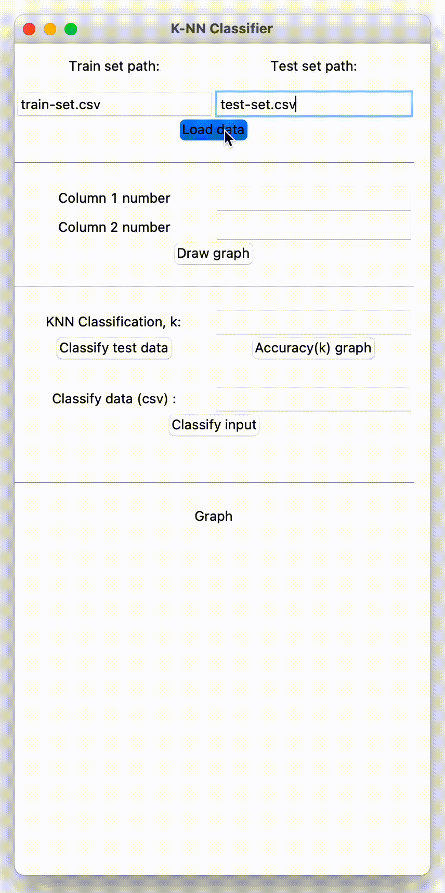

# K-Nearest Neighbor (KNN) Euclidean classifier in Python

## What knn is?
#### Definitions:

<dl>
  <dt>train set</dt>
  <dd>classified samples (reference points)</dd>
  <dt>test set</dt>
  <dd>classified samples (samples for testing accuracy of our classification algorithm)</dd>
  <dt>k</dt>
  <dd>number of nearest samples we want to take into account when classifying</dd>
</dl>

KNN is a basic classification method. It's based on distance finding algorithm. It measures distance from data sample we want to classify to other samples in **train set**. Then we take **k** nearest samples from train set to unclassified sample. Class that has majority in the **"k nearest"** set is our supposed class for unclassified data sample. 

Distance finding algorithm in this project is based on [Euclidean distance](https://en.wikipedia.org/wiki/Euclidean_distance) formula: 
=\sqrt{\sum_{i=i}^{n}(y_{i}-x_{i})}) 

### Simple example of classifying by euclidean distance: 
#### Train set:
| data1 | data2 |    class   |
| ----- |:-----:| ----------:|
|  4.5  |  3.2  |   setosa   |
|  2.3  |  4.7  | versicolor |

#### Test set:
| data1 | data2 |    class   |
| ----- |:-----:| ----------:|
|  3.8  |  2.5  |  ????????? |

Distance from: **unclassified**, to: setosa, **train set**: 
=\sqrt{(4.5-3.8)^2+(3.2-2.5)^2}\approx%200.99)  
Distance from: **unclassified**, to: versicolor, **train set**: 
=\sqrt{(2.3-3.8)^2+(4.7-2.5)^2}\approx%202.66)  

Now, assuming **k** = **1**, we choose 1 nearest neighbor from **train set**. 
Using given **train set**, we can classify **test** sample to **setosa** class.  

## Program workflow
### 1. Input files
Path to **train set** and **test set**. Both should:
  * be *.csv* files
  * contain same number of columns in the same order
  * have last column containing class

If files were read correctly, input fields should appear green.
### 2. Draw graph
This section provides functionality of **plotting** points **in 2D** with desired columns data. **Column 1** will represent **x axis** and **column 2** - **y axis**. 
**inputs:** integers
### 3. Knn Classification
First, you specify value of **k**. Then, you can either:
<dl>
  <dt>Classify test data</dt>
  <dd>Classifies test set and measures accuracy of guesses. -Essential to finding best k for classification, using given train set.</dd>
  <dt>Accuracy graph</dt>
  <dd>Draws accuracy graph where x is [k from 1 to len(testset)] and y is accuracy(k). -Visualization of accuracy changing with k</dd>
  <dt>Classify input</dt>
  <dd>Enter sample data for classification. -Tool for classification unknown samples (use when k is already calibrated)</dd>
</dl>
